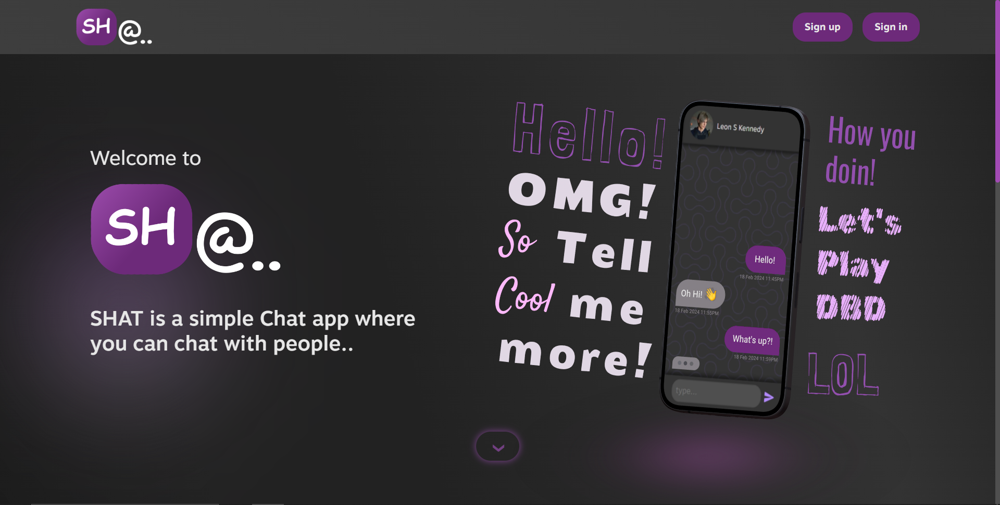
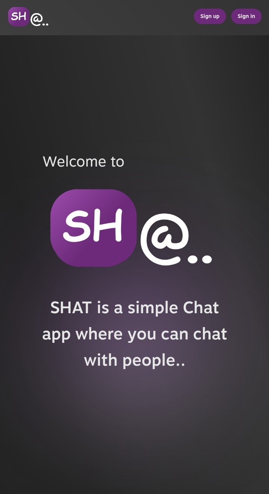
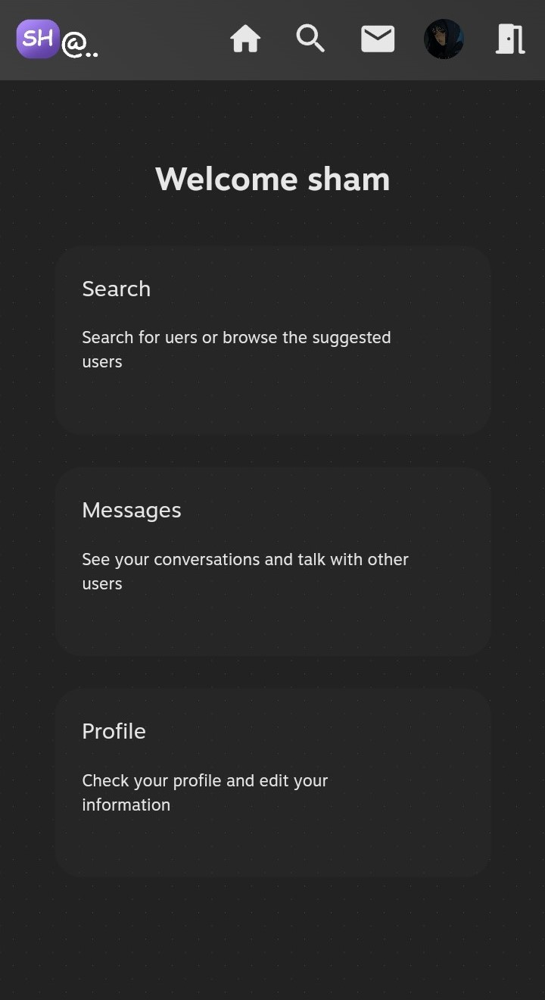
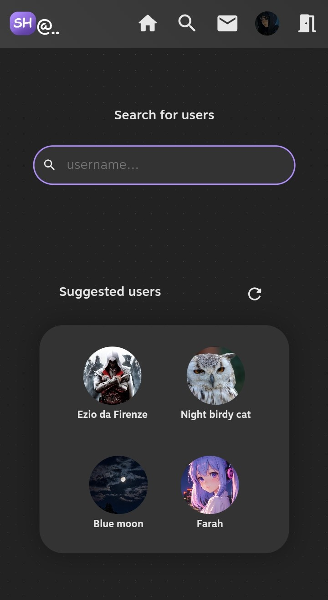
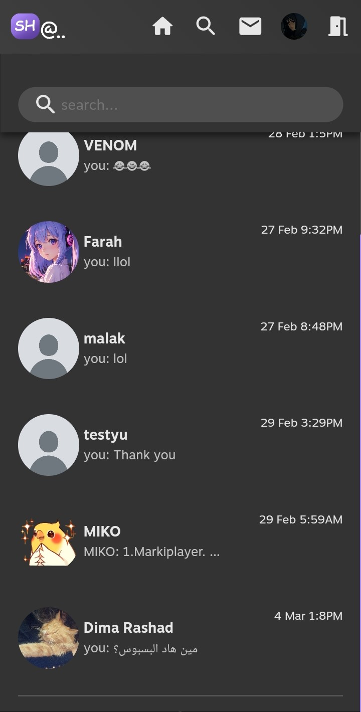
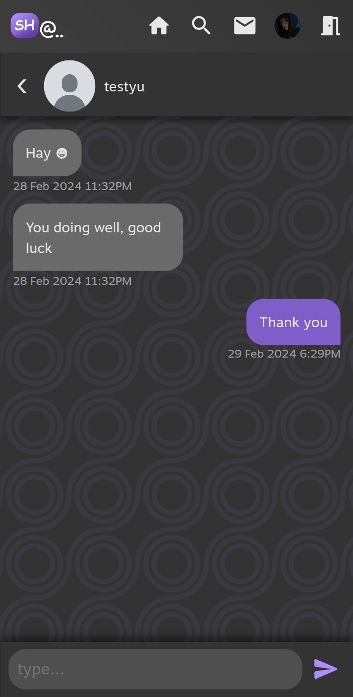
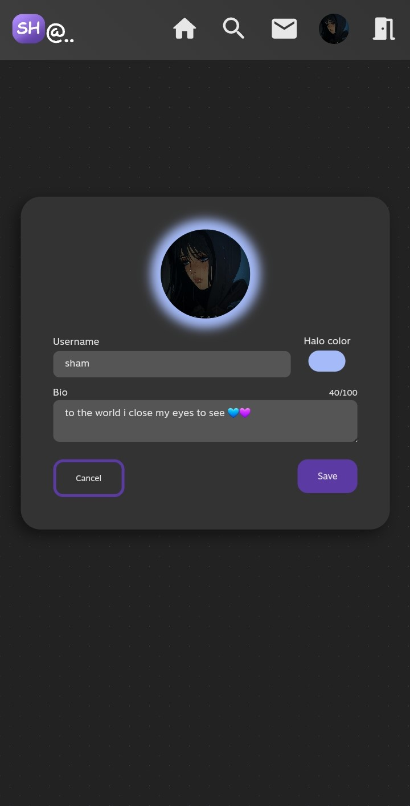

# Shat 1.0.1

[Try Shat](https://shat.netlify.app/) | [Watch demo](https://drive.google.com/file/d/1koQDwlB4SsuY25M5MPPvi76-0GQTntI4/view)

Shat is a web-based app that allows users to connect, chat, and edit their profiles.

## Screenshots

### Laptop

### Mobile

