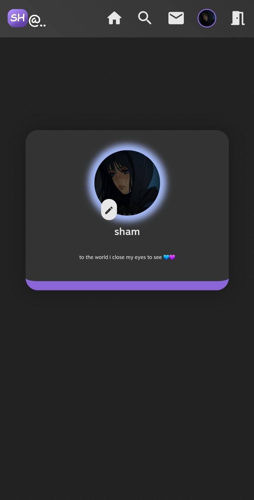

# Shat 1.0.1

[Try Shat](https://shat.netlify.app/) | [Watch demo](https://drive.google.com/file/d/1koQDwlB4SsuY25M5MPPvi76-0GQTntI4/view)

Shat is a web-based app that allows users to connect, chat, and edit their profiles.

### Features:
- Users can create an account
- Users can edit their profile information 
- Users can search for other users 
- Users can view other users information
- Users can chat with each other
- Users can delete conversations
- Users can edit any message in a conversation 
- Users can delete any message in a conversation
- Real time chatting
- Typing indicator

#### coming Features:
- sending media and voice records
- deleting other users messages in a conversation 
- notification when receiving a new message
- message read indicators
- new and unread messages badge
- voice and video calls
- group chats
- block users
- adding a chat bot 

## Screenshots

### Laptop

### Mobile

